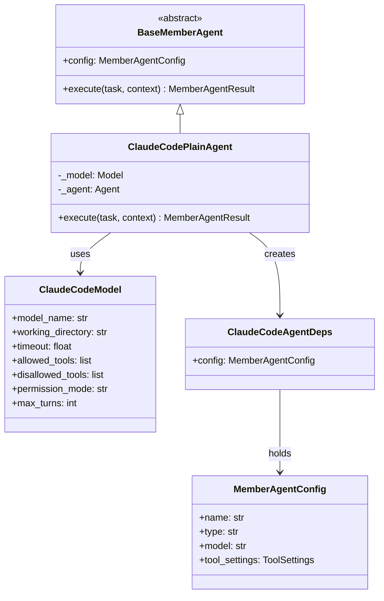
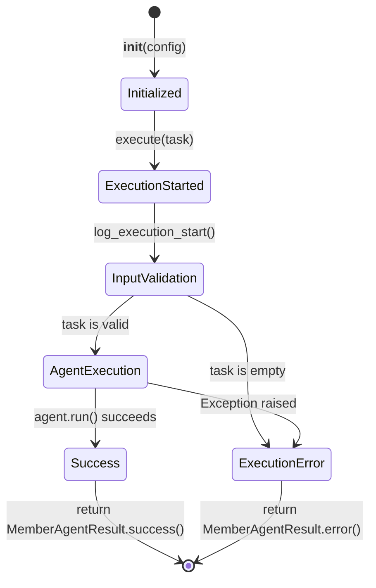

# Data Model: ClaudeCodeプロバイダー

**Date**: 2026-01-17
**Status**: Draft

## Entities

### 1. ClaudeCodeModel

**説明**: Claude Code CLI経由でLLMを呼び出すモデル

**ソース**: `claudecode-model` パッケージ（外部依存）

```python
class ClaudeCodeModel(Model):
    """pydantic-ai Model implementation for Claude Code CLI."""

    model_name: str
    working_directory: str | None
    timeout: float
    allowed_tools: list[str] | None
    disallowed_tools: list[str] | None
    permission_mode: str | None
    max_turns: int | None
```

**属性**:
| フィールド | 型 | 説明 | デフォルト |
|-----------|-----|------|----------|
| `model_name` | `str` | モデル名 | `"claude-sonnet-4-5"` |
| `working_directory` | `str \| None` | 作業ディレクトリ | `None` |
| `timeout` | `float` | タイムアウト（秒） | `120.0` |
| `allowed_tools` | `list[str] \| None` | 許可ツールリスト | `None` |
| `disallowed_tools` | `list[str] \| None` | 禁止ツールリスト | `None` |
| `permission_mode` | `str \| None` | パーミッションモード | `None` |
| `max_turns` | `int \| None` | 最大ターン数 | `None` |

**サポートモデル**:
- Current: `claude-sonnet-4-5`, `claude-haiku-4-5`, `claude-opus-4-5`
- Legacy: `claude-opus-4-1`, `claude-sonnet-4-0`, `claude-opus-4-0`
- フルバージョン: `claude-sonnet-4-5-20250929` 等

### 2. ClaudeCodePlainAgent

**説明**: ClaudeCodeModelを使用するMember Agent

**継承**: `BaseMemberAgent` (mixseek-core)

```python
class ClaudeCodePlainAgent(BaseMemberAgent):
    """Plain Member Agent using ClaudeCode models."""

    _model: Model
    _agent: Agent[ClaudeCodeAgentDeps, str]
```

**コンストラクタパラメータ**:
| パラメータ | 型 | 説明 |
|-----------|-----|------|
| `config` | `MemberAgentConfig` | エージェント設定 |

**メソッド**:
| メソッド | 戻り値 | 説明 |
|---------|--------|------|
| `execute(task, context, **kwargs)` | `MemberAgentResult` | タスク実行 |

### 3. ClaudeCodeAgentDeps

**説明**: ClaudeCodeAgent用の依存関係コンテナ

```python
@dataclass
class ClaudeCodeAgentDeps:
    """Dependencies for ClaudeCode agents."""

    config: MemberAgentConfig
```

### 4. ClaudeCodeToolSettings

**説明**: ClaudeCode固有のツール設定（TOMLから取得）

```python
class ClaudeCodeToolSettings(TypedDict, total=False):
    """ClaudeCode-specific tool settings from TOML config."""

    allowed_tools: list[str]
    disallowed_tools: list[str]
    permission_mode: str
    working_directory: str
    max_turns: int
    timeout_seconds: int
```

**TOML表現**:
```toml
[members.tool_settings.claudecode]
allowed_tools = ["Read", "Glob", "Grep", "Bash"]
disallowed_tools = ["Write", "Edit"]
permission_mode = "bypassPermissions"
working_directory = "/tmp"
max_turns = 5
timeout_seconds = 7200
```

### 5. ClaudeCodeNotPatchedError

**説明**: パッチ未適用時のエラー

```python
class ClaudeCodeNotPatchedError(Exception):
    """Raised when claudecode: model is used without calling patch_core()."""

    def __init__(self, message: str | None = None) -> None:
        if message is None:
            message = (
                "ClaudeCode models are not yet enabled for Leader/Evaluator. "
                "Please call mixseek_plus.patch_core() before using claudecode: models."
            )
        super().__init__(message)
```

## Relationships



## State Transitions

### ClaudeCodePlainAgent Execution Flow



## Validation Rules

### モデルID形式

| ルール | 正規表現 | 例 |
|--------|---------|-----|
| 有効なモデルID | `claudecode:[a-z0-9-]+` | `claudecode:claude-sonnet-4-5` |
| フルバージョン | `claudecode:[a-z0-9-]+-[0-9]+` | `claudecode:claude-sonnet-4-5-20250929` |

### tool_settings検証

| フィールド | 検証 |
|-----------|------|
| `allowed_tools` | 文字列リスト、空許可 |
| `disallowed_tools` | 文字列リスト、空許可 |
| `permission_mode` | 文字列、特定値は検証しない |
| `working_directory` | 文字列、パス存在チェックなし |
| `max_turns` | 正整数 |
| `timeout_seconds` | 正整数、CLIセッションタイムアウト（デフォルト: 7200） |

## Error Types

| エラー | 発生条件 | エラーコード |
|--------|---------|-------------|
| `CLINotFoundError` | Claude Code CLIが見つからない | `CLI_NOT_FOUND` |
| `CLIExecutionError` | CLI実行中のエラー | `CLI_EXECUTION_ERROR` |
| `CLIResponseParseError` | レスポンス解析失敗 | `CLI_PARSE_ERROR` |
| `ModelCreationError` | モデル作成失敗 | N/A |
| `ClaudeCodeNotPatchedError` | パッチ未適用 | N/A |
