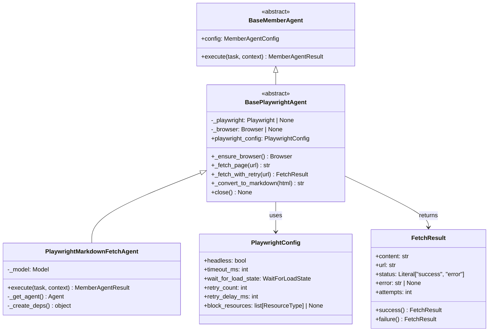

# Data Model: Playwright + MarkItDown統合Webフェッチャー

**Feature Branch**: `031-playwright-markdown-fetch`
**Created**: 2026-01-19
**Status**: Complete

## Entities

### 1. PlaywrightConfig

Playwright固有の設定を管理するPydanticモデル。

```python
from typing import Literal
from pydantic import BaseModel, Field

WaitForLoadState = Literal["load", "domcontentloaded", "networkidle"]
ResourceType = Literal[
    "document", "stylesheet", "image", "media", "font",
    "script", "texttrack", "xhr", "fetch", "eventsource",
    "websocket", "manifest", "other"
]


class PlaywrightConfig(BaseModel):
    """Playwright固有の設定.

    Attributes:
        headless: ヘッドレスモードで実行するか（デフォルト: True）
        timeout_ms: ページ読み込みタイムアウト（ミリ秒）（デフォルト: 30000）
        wait_for_load_state: 待機条件（デフォルト: "load"）
        retry_count: リトライ回数（デフォルト: 0）
        retry_delay_ms: リトライ遅延（ミリ秒）（デフォルト: 1000）
        block_resources: ブロックするリソースタイプ（デフォルト: None）
    """

    headless: bool = Field(default=True, description="ヘッドレスモードで実行")
    timeout_ms: int = Field(default=30000, ge=1000, le=300000, description="タイムアウト（ms）")
    wait_for_load_state: WaitForLoadState = Field(default="load", description="待機条件")
    retry_count: int = Field(default=0, ge=0, le=10, description="リトライ回数")
    retry_delay_ms: int = Field(default=1000, ge=100, le=60000, description="リトライ遅延（ms）")
    block_resources: list[ResourceType] | None = Field(default=None, description="ブロックするリソース")
```

**Validation Rules**:
- `timeout_ms`: 1000〜300000の範囲（1秒〜5分）
- `retry_count`: 0〜10の範囲
- `retry_delay_ms`: 100〜60000の範囲（0.1秒〜1分）
- `wait_for_load_state`: Playwrightがサポートする3種類のみ

---

### 2. FetchResult

ページ取得結果を表すデータクラス。

```python
from dataclasses import dataclass
from typing import Literal


@dataclass(frozen=True)
class FetchResult:
    """ページ取得結果.

    Attributes:
        content: 取得したMarkdownコンテンツ
        url: 最終的なURL（リダイレクト後）
        status: 成功/失敗
        error: エラーメッセージ（失敗時のみ）
        attempts: 試行回数
    """

    content: str
    url: str
    status: Literal["success", "error"]
    error: str | None = None
    attempts: int = 1

    @classmethod
    def success(cls, content: str, url: str, attempts: int = 1) -> "FetchResult":
        """成功結果を作成."""
        return cls(content=content, url=url, status="success", attempts=attempts)

    @classmethod
    def failure(cls, url: str, error: str, attempts: int = 1) -> "FetchResult":
        """失敗結果を作成."""
        return cls(content="", url=url, status="error", error=error, attempts=attempts)
```

**State Transitions**: N/A（immutable dataclass）

---

### 3. PlaywrightMarkdownFetchAgentConfig

エージェント設定を表す型。MemberAgentConfigを拡張。

```python
from mixseek.models.member_agent import MemberAgentConfig


class PlaywrightMarkdownFetchAgentConfig(MemberAgentConfig):
    """PlaywrightMarkdownFetchAgent用の設定.

    MemberAgentConfigを継承し、playwright_settings フィールドを追加。
    TOML設定の[playwright]セクションから読み込む。

    Example TOML:
        [[members]]
        name = "web-fetcher"
        type = "playwright_markdown_fetch"
        model = "groq:llama-3.3-70b-versatile"

        [members.playwright]
        headless = false
        timeout_ms = 60000
        wait_for_load_state = "networkidle"
        block_resources = ["image", "font"]
    """

    playwright_settings: PlaywrightConfig | None = None
```

---

### 4. Error Classes

エラークラス定義。

```python
class PlaywrightNotInstalledError(ImportError):
    """Playwrightがインストールされていない場合のエラー.

    Example:
        raise PlaywrightNotInstalledError()
        # Output:
        # playwright is not installed. Install it with:
        #   pip install mixseek-plus[playwright]
        #   playwright install chromium
    """

    def __init__(self, message: str | None = None) -> None:
        if message is None:
            message = (
                "playwright is not installed. Install it with:\n"
                "  pip install mixseek-plus[playwright]\n"
                "  playwright install chromium"
            )
        super().__init__(message)


class FetchError(Exception):
    """ページ取得に失敗した場合のエラー.

    Attributes:
        url: 取得を試みたURL
        cause: 原因となった例外
        attempts: 試行回数
    """

    def __init__(
        self,
        message: str,
        url: str,
        cause: Exception | None = None,
        attempts: int = 1,
    ) -> None:
        self.url = url
        self.cause = cause
        self.attempts = attempts
        super().__init__(message)


class ConversionError(Exception):
    """HTML→Markdown変換に失敗した場合のエラー.

    Attributes:
        url: 変換元のURL
        cause: 原因となった例外
    """

    def __init__(
        self,
        message: str,
        url: str,
        cause: Exception | None = None,
    ) -> None:
        self.url = url
        self.cause = cause
        super().__init__(message)
```

---

## Class Diagram



---

## Tool Definition

### fetch_page ツール

LLMが呼び出すツール定義。

```python
from pydantic import BaseModel, Field
from pydantic_ai import Tool


class FetchPageInput(BaseModel):
    """fetch_pageツールの入力スキーマ."""

    url: str = Field(description="取得するWebページのURL")


@Tool(name="fetch_page", description="Webページを取得してMarkdown形式で返却する")
async def fetch_page(ctx: RunContext[PlaywrightDeps], url: str) -> str:
    """Webページを取得してMarkdownに変換.

    Args:
        ctx: 実行コンテキスト（Playwrightエージェントへの参照を含む）
        url: 取得するURL

    Returns:
        Markdown形式のページコンテンツ

    Raises:
        FetchError: ページ取得に失敗した場合
        ConversionError: Markdown変換に失敗した場合
    """
    result = await ctx.deps.agent._fetch_with_retry(url)

    if result.status == "error":
        return f"Error fetching {url}: {result.error}"

    return result.content
```

---

## TOML Configuration Example

```toml
[[members]]
name = "web-fetcher"
type = "playwright_markdown_fetch"
model = "groq:llama-3.3-70b-versatile"
system_prompt = """
あなたはWebページを取得してユーザーの質問に答えるアシスタントです。
fetch_pageツールを使用してWebページの内容を取得し、その内容に基づいて回答してください。
"""

[members.playwright]
headless = false
timeout_ms = 60000
wait_for_load_state = "networkidle"
retry_count = 3
retry_delay_ms = 1000
block_resources = ["image", "font", "media"]
```

---

## Relationship to Existing Entities

| 既存エンティティ | 関係 | 説明 |
|-----------------|------|------|
| `MemberAgentConfig` | 継承 | PlaywrightMarkdownFetchAgentConfigの基底クラス |
| `BaseMemberAgent` | 継承 | BasePlaywrightAgentの基底クラス |
| `MemberAgentResult` | 使用 | execute()の戻り値型 |
| `MemberAgentFactory` | 登録 | register_playwright_agents()で登録 |
| `Model` (pydantic-ai) | 使用 | create_model()で作成 |
